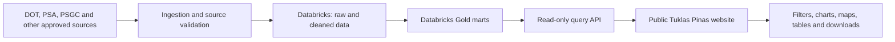

# Tuklas Pinas Data Platform

A public-facing tourism and local economy data platform for exploring tourism activity across Philippine destinations and how it relates to local economic, geographic, and population conditions.

**GitHub organization:** [ftw-git-away](https://github.com/ftw-git-away)  
**Project status:** Capstone project in development

## The problem

What makes tourism and local economic information difficult to compare destinations or understand where tourism opportunities are concentrated is that it's published by multiple agencies, with different geographic levels, reporting periods, and classifications.

_Tuklas Pinas_ aims to bring compatible, documented datasets together and make the resulting indicators accessible through a public website. Visitors should be able to explore published data through filters, visualizations, tables, and downloads.

## Questions the platform is designed to explore

- Which destinations and provinces show tourism activity in the available data?
- Where are tourism opportunities concentrated?
- How do tourism indicators relate to local economic and population conditions?
- How do these patterns change over time?

## Intended users

- Travelers, researchers, students, and the public looking for accessible tourism information
- Local planners and tourism stakeholders exploring destination-level indicators
- Project contributors who need documented, reproducible data models and pipelines

## Data sources

These are candidate public sources. The team will confirm dataset availability, definitions, licensing, update frequency, and geographic coverage before integrating them.

| Candidate source | Potential contribution |
| --- | --- |
| [Department of Tourism data](https://www.tourism.gov.ph/dot/data/) | Tourism indicators and statistics |
| Philippine Statistics Authority (PSA) | Population statistics, tourism satellite accounts, and regional GDP/GRDP |
| Philippine Standard Geographic Code (PSGC) | Standard geographic identifiers and administrative classifications |

Each integrated dataset should have a source record, retrieval date, licensing and attribution notes, coverage description, and transformation history.

## Proposed platform architecture

The design separates data processing from the public experience:

- **Databricks** is the planned environment for ingesting, transforming, validating, and serving curated Gold marts.
- **The public data platform** will present indicators and let visitors explore supported dimensions such as geography, time, and indicator.
- **GitHub** holds source code, SQL, documentation, issues, project planning, and automation. GitHub Pages can host a static site.
- Databricks Apps require authenticated Databricks users, so they are not the assumed host for an anonymously accessible public portal. The team will verify hosting and access choices before implementation.

As of September 27, 2026: This is a proposed architecture, not a claim that the pipeline or website is already deployed.

## Data model and quality

Model documentation should identify:

- The grain of every table (what one row represents)
- Primary and foreign keys, including geographic and date keys
- Important fields, data types, units, and definitions
- Source-to-target lineage and transformation rules
- Known coverage gaps, null handling, and caveats

Planned validation includes checks appropriate to each source, such as required fields, valid dates and codes, uniqueness at the documented grain, accepted value ranges, and reconciliation against source totals where possible. Failed critical checks should stop publication of affected data until reviewed.

## Repository guide

The repository is being established. As implementation grows, it will hold the project's authoritative code and documentation. Proposed areas include:

- `docs/` - architecture, data model, decisions, and operating guides
- `src/` - ingestion, transformation, API, and website code as those components are selected
- `notebooks/` - contains the compiled, documented Databricks workflow
- `tests/` - data and application validation
- `.github/` - collaboration and automation workflows

Numbered folders show execution order; file names use lowercase snake_case.

The repository's actual structure and run instructions will be documented here as files are added.

## Project milestones

1. Confirm questions, data sources, licensing, coverage, and project scope.
2. Design and document the schemas, keys, grains, and source mappings.
3. Build and validate the Gold marts.
4. Develop the query experience, analytics, and public website.
5. Document setup, validation results, engineering decisions, and limitations.
6. Prepare the demonstration and capstone defense.

Use the organization's GitHub Project as the current source of truth for assignments, status, and target dates.

## Team

GitAway is the FTW Batch 12 Data Engineering capstone team working on Tuklas Pinas.

- Cole
- Nella
- Cha
- Gab
- Haze

## Contributing

Work should be traceable and reviewable:

1. Pick up or create an issue describing the work and its acceptance criteria.
2. Make a focused change on a branch.
3. Open a pull request that links the issue and explains the change and validation.
4. Request a teammate review and address feedback before merging.

Do not commit credentials, access tokens, private data, or unpublished personal information. Keep commit messages and pull requests specific so the project history shows what changed and why.

## Handoff readiness

This README describes the intended project and proposed architecture. It does not yet provide complete setup and run instructions or prove that the pipeline and public portal are operational. The project should be considered **Not yet ready** for independent engineering handoff until an engineer can set it up, run it, inspect meaningful validation results, and modify the documented models without clarification.

